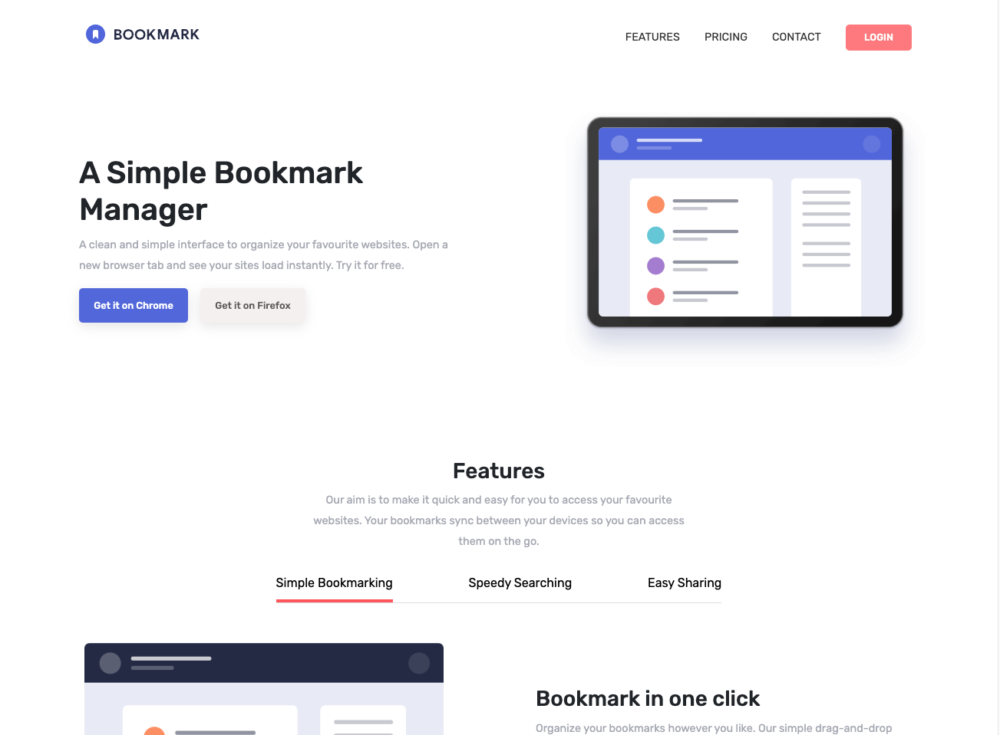

# Frontend Mentor - Bookmark landing page solution

I used mainly Javascript with JQuery and some Bootstrap for the buttons and small components.
This project helped me with reinforcing my Javascript and JQeury knowledge.

This is a solution to the [Bookmark landing page challenge on Frontend Mentor](https://www.frontendmentor.io/challenges/bookmark-landing-page-5d0b588a9edda32581d29158). Frontend Mentor challenges help you improve your coding skills by building realistic projects. 

## Table of contents

- [Frontend Mentor - Bookmark landing page solution](#frontend-mentor---bookmark-landing-page-solution)
  - [Table of contents](#table-of-contents)
  - [Overview](#overview)
    - [The challenge](#the-challenge)
    - [Screenshot](#screenshot)
    - [Links](#links)
  - [My process](#my-process)
    - [Built with](#built-with)
    - [Continued development](#continued-development)
    - [Useful resources](#useful-resources)
  - [Author](#author)

## Overview

### The challenge

Users should be able to:

- View the optimal layout for the site depending on their device's screen size
- See hover states for all interactive elements on the page
- Receive an error message when the newsletter form is submitted if:
  - The input field is empty
  - The email address is not formatted correctly

### Screenshot

### Links

- Solution URL: [Github](https://github.com/Kevin27j/Bookmark-landing-page)
- Live Site URL: [Github Pages](https://kevin27j.github.io/Bookmark-landing-page/)

## My process

### Built with

- HTML5
- CSS 
- Flexbox
- Mobile-first workflow
- Bootstrap
- Javascript
- JQuery

### Continued development

I want to use this project as a base for implementing React and maybe other tools.

### Useful resources

- [FAQ Accordion Style](https://wpbeaches.com/create-expandcollapse-faq-accordion-collapse-click/) - This helped me to create an accordion effect for the FAQ section questions. When clicking any of the question the container expands with an answer.
  
## Author

- Website - (https://kevin27j.github.io/Bootstrap-Portfolio/)
- Frontend Mentor - [@Kevin27j](https://www.frontendmentor.io/profile/Kevin27j)
